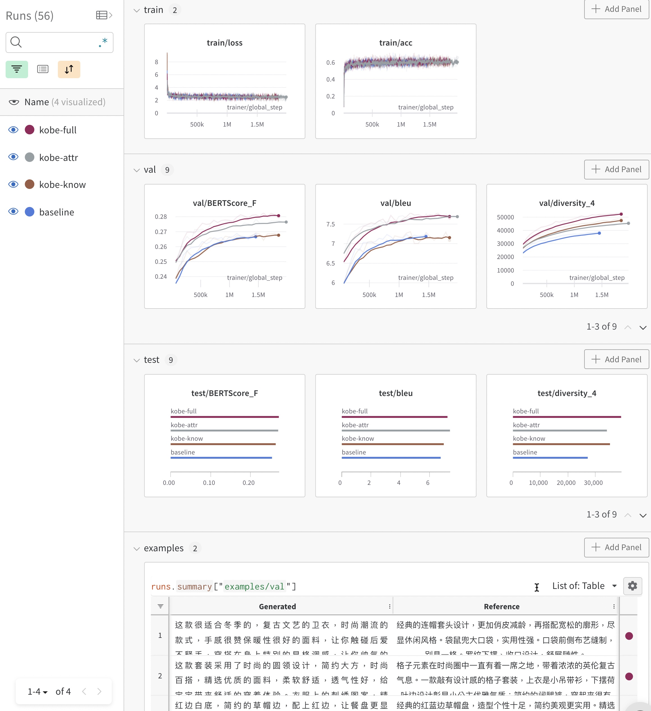

## [KOBE v2: Towards Knowledge-Based Personalized Product Description Generation in E-commerce](https://arxiv.org/abs/1903.12457)

[](https://github.com/THUDM/KOBE/actions/workflows/install.yml)
[](https://github.com/THUDM/KOBE/stargazers)
[](https://github.com/THUDM/KOBE/blob/master/LICENSE)
[](https://github.com/ambv/black)

**New:** We release **KOBE v2**, a refactored version of the original code with the latest deep learning tools in 2021 and greatly improved installation, reproducibility, performance, and visualization, in memory of Kobe Bryant.

This repo contains code and pre-trained models for KOBE, a sequence-to-sequence based approach for automatically generating product descriptions by leveraging conditional inputs, e.g., user category, and incorporating knowledge with retrieval augmented product titles.

Paper accepted at KDD 2019 (Applied Data Science Track). Latest version at [arXiv](https://arxiv.org/abs/1903.12457).

- [KOBE v2: Towards Knowledge-Based Personalized Product Description Generation in E-commerce](#kobe-v2-towards-knowledge-based-personalized-product-description-generation-in-e-commerce)
- [Prerequisites](#prerequisites)
- [Getting Started](#getting-started)
  - [Installation](#installation)
  - [Dataset](#dataset)
- [Preprocessing](#preprocessing)
  - [Build vocabulary](#build-vocabulary)
  - [Tokenization](#tokenization)
- [Experiments](#experiments)
  - [Visualization with WandB](#visualization-with-wandb)
  - [Training your own KOBE](#training-your-own-kobe)
  - [Evaluating KOBE](#evaluating-kobe)
  - [Pre-trained Models](#pre-trained-models)
- [Cite](#cite)

## Prerequisites

- Linux
- Python >= 3.8
- PyTorch >= 1.10

## Getting Started

### Installation

Clone and install KOBE.

```bash
git clone https://github.com/THUDM/KOBE
cd KOBE
pip install -e .
```

Verify that KOBE is correctly installed by `import kobe`.

### Dataset

We use the **TaoDescribe** dataset, which contains 2,129,187 product titles and descriptions in Chinese.

Run the following command to automatically download the dataset:

```bash
python -m kobe.data.download
```

The downloaded files will be placed at `saved/raw/`:

```
 1.6G KOBE/saved
 1.6G ├──raw
  42K │  ├──test.cond
 1.4M │  ├──test.desc
 2.0M │  ├──test.fact
 450K │  ├──test.title
  17M │  ├──train.cond
 553M │  ├──train.desc
 794M │  ├──train.fact
 183M │  ├──train.title
  80K │  ├──valid.cond
 2.6M │  ├──valid.desc
 3.7M │  ├──valid.fact
 853K │  └──valid.title
...
```

<details>
<summary>
Meanings of downloaded data files
</summary>
<ul>
<li> train/valid/test.title: The product title as input (source) </li>
<li> train/valid/test.desc: The product description as output (generation target) </li>
<li> train/valid/test.cond: The product attribute and user category used as conditions in the KOBE model. The interpretations of these tags are explained at https://github.com/THUDM/KOBE/issues/14#issuecomment-516262659. </li>
<li> train/valid/test.fact: The retrieved knowledge for each product </li>
</ul>
</details>

## Preprocessing

Preprocessing is a commonly neglected part in code release. However, we now provide the preprocessing scripts to rebuild the vocabulary and tokenize the texts, just in case that you wish to preprocess the KOBE data yourself or need to run on your own data.

### Build vocabulary

We use BPE to build a vocabulary on the conditions (including attributes and user categories). For texts, we will use existing BertTokenizer from the huggingface transformers library.

```bash
python -m kobe.data.vocab \
  --input saved/raw/train.cond \
  --vocab-file saved/vocab.cond \
  --vocab-size 31 --algo word
```

### Tokenization

Then, we will tokenize the raw inputs and save the preprocessed samples to `.tar` files. Note: this process can take a while (about 20 minutes with a 8-core processor).

```bash
python -m kobe.data.preprocess \
  --raw-path saved/raw/ \
  --processed-path saved/processed/ \
  --split train valid test \
  --vocab-file bert-base-chinese \
  --cond-vocab-file saved/vocab.cond.model
```

You can peek into the `saved/` directories to see what these preprocessing scripts did:

```
 8.2G KOBE/saved
  16G ├──processed
  20M │  ├──test.tar
 1.0G │  ├──train-0.tar
 1.0G │  ├──train-1.tar
 1.0G │  ├──train-2.tar
 1.0G │  ├──train-3.tar
 1.0G │  ├──train-4.tar
 1.0G │  ├──train-5.tar
 1.0G │  ├──train-6.tar
 1.0G │  ├──train-7.tar
  38M │  └──valid.tar
 1.6G ├──raw
      │  ├──...
 238K └──vocab.cond.model
```

## Experiments

### Visualization with WandB

First, set up [WandB](https://wandb.ai/), which is an 🌟 incredible tool for visualize deep learning experiments. In case you haven't use it before, please login and follow the instructions.

```bash
wandb login
```

### Training your own KOBE

We provide four training modes: `baseline`, `kobe-attr`, `kobe-know`, `kobe-full`, corresponding to the models explored in the paper. They can be trained with the following commands:

```bash
python -m kobe.train --mode baseline --name baseline
python -m kobe.train --mode kobe-attr --name kobe-attr
python -m kobe.train --mode kobe-know --name kobe-know
python -m kobe.train --mode kobe-full --name kobe-full
```

After launching any of the experiment above, please go to the WandB link printed out in the terminal to view the training progress and evaluation results (updated at every epoch end about once per 2 hours).

If you would like to change other hyperparameters, please look at `kobe/utils/options.py`. For example, the default setting train the models for 30 epochs with batch size 64, which is around 1 millison steps. You could add options like `--epochs 100` to train for more epochs and obtain better results. You can also increase `--num-encoder-layers` and `--num-decoder-layers` if better GPUs available.

**Expected Training Progress**

We provide a reference for the training progress (training takes about 150 hours on a 2080 Ti). The full KOBE model achieves the best BERTScore and diversity, with a slightly lower BLEU score than KOBE-Attr (as shown in the paper).

The resulting training/validation/test curves and examples are shown below:



### Evaluating KOBE

Evaluation is now super convenient and reproducible with the help of pytorch-lightning and WandB. The checkpoint with best bleu score will be saved at `kobe-v2/<wandb-run-id>/checkpoints/<best_epoch-best_step>.ckpt`. To evaluate this model, run the following command:

```bash
python -m kobe.train --mode baseline --name test-baseline --test --load-file kobe-v2/<wandb-run-id>/checkpoints/<best_epoch-best_step>.ckpt
```

The results will be displayed on the WandB dashboard with the link printed out in the terminal. The evaluation metrics we provide include BLEU score (sacreBLEU), diversity score and [BERTScore](https://arxiv.org/abs/1904.09675). You can also manually view some generated examples and their references under the `examples/` section on WandB.

We provide Nucleus sampling (https://arxiv.org/abs/1904.09751) to replace the beam search in the original KOBE paper. To test this great decoding strategy, run:

```
python -m kobe.train --mode baseline --name test-baseline --test --load-file kobe-v2/<wandb-run-id>/checkpoints/<best_epoch-best_step>.ckpt --decoding-strategy nucleus
```

### Pre-trained Models

If you wish to obtain the trained KOBE models, please contact us via email or wait for future updates.

## Cite

Please cite our paper if you use this code in your own work:

```
@inproceedings{chen2019towards,
  title={Towards knowledge-based personalized product description generation in e-commerce},
  author={Chen, Qibin and Lin, Junyang and Zhang, Yichang and Yang, Hongxia and Zhou, Jingren and Tang, Jie},
  booktitle={Proceedings of the 25th ACM SIGKDD International Conference on Knowledge Discovery \& Data Mining},
  pages={3040--3050},
  year={2019}
}
```
